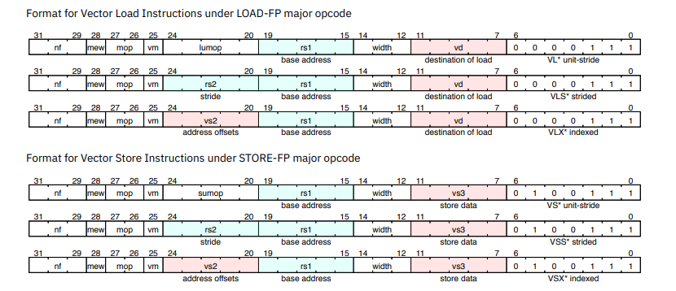

# AI 加速系统

# Proj1: 用于 Conv2D 的脉动阵列

## 1.1 简介

该项目设计了一个基于**脉动阵列**的系统，通过将卷积操作转化为**通用矩阵乘法（GEMM）**来加速卷积神经网络（CNN）中的卷积计算。系统设计图如图1-1所示。

具体实现了 **Img2Col**、**脉动阵列（Systolic Array）**以及内部**处理单元（PE，Processing Element）**。**Img2Col** 将每个卷积窗口内的输入转换为向量，并将其堆叠成一个新矩阵，按列优先顺序存储在内存中。**systolic\_array** 模块实例化一个**输出固定型**脉动阵列，由多个 PE 组成，它从 **X\_buffer** 接收激活值 X，从 **W\_buffer** 接收权重值 W。在所有计算完成后，PE 中累加器的输出 Y 会被写回到内存中。

<p align="center">
  
</p>
<p align = "center">
  <i>图1-1：系统顶层图</i>
</p>

下面解释如何将 Conv2D 操作映射到 GEMM，并讨论使用脉动阵列（systolic array）进行此类任务的优点。

### 1.1.1 卷积层的计算

在卷积神经网络（CNN）中，卷积层的输入通常表示为一个4维张量，形状为 (N, C, H, W)（对于 NCHW 格式）或 (N, H, W, C)（对于 NHWC 格式），其中：

- **N**: 输入样本的数量（batch size），在本实验中为1。
- **C**: 输入通道（channel）的数量。
- **H**: 输入图像的高度（height）。
- **W**: 输入图像的宽度（width）。

本文将使用 IMG\_C、IMG\_H、IMG\_W 来描述输入的维度。

卷积滤波器表示为另一个张量，维度为 (FILTER\_NUM, IMG\_C, FILTER\_SIZE, FILTER\_SIZE)，其中：

- **FILTER\_NUM**: 滤波器的数量，表示输出通道的数量。
- **IMG\_C**: 通道的数量，应与输入的通道数相同。
- **FILTER\_SIZE**: 滤波器的高度和宽度（假设为方形滤波器）。

卷积层的输出维度由以下公式给出：

- **OUT\_H** = (IMG\_H + 2 * PADDING - FILTER\_SIZE) // STRIDE + 1

- **OUT\_W** = (IMG\_W + 2 * PADDING - FILTER\_SIZE) // STRIDE + 1


在本项目中，STRIDE 始终为1，且 OUT\_H/W 始终等于 IMG\_H/W。

#### 1.1.1.1 通过 Img2Col 将卷积操作映射为 GEMM

为了利用系统阵列中矩阵乘法的高效性，卷积操作可以转化为 GEMM（矩阵乘法）。这个转化通过 **img2col** 方法实现，该方法**将输入张量展开成适合矩阵乘法的列**。

1. **展开输入图像**: 对输入张量进行大小为 PADDING 的零填充，以满足卷积的要求。

2. **构造输入矩阵 X**: 将填充后的张量展开为矩阵 X，维度为 (OUT\_H * OUT\_W, FILTER\_SIZE * FILTER\_SIZE * IMG\_C)。此处，矩阵 X 的每一行对应于输入图像上特定位置的滤波器感受野。

<p align="center">
  
</p>
<p align = "center">
  <i>图1-2：Img2Col 示例</i>
</p>

3. **构造权重矩阵 W**: 将卷积滤波器张量 reshape 为矩阵 W，维度为 (FILTER\_SIZE * FILTER\_SIZE * IMG\_C, FILTER\_NUM)。

4. **矩阵乘法**: 将矩阵 X 与矩阵 W 相乘，得到矩阵 Y，维度为 (OUT\_H * OUT\_W, FILTER\_NUM)。

**注:** 在本项目中，直接验证输出矩阵 Y 的结果，而不将其转换回张量。

### 1.1.2 输出固定型脉动阵列

在脉动处理器阵列中，基本组件是 **PE**。对于输出固定的脉动阵列，每个 PE 使用 **X\_in** 和 **W\_in** 进行乘法运算。然后，将该结果累加到该位置的输出结果 **Y\_out** 中（在复位时初始化为 0）。此外，**X\_in** 和 **W\_in** 会通过 PE 传递给相邻的 PE。在每个时钟周期中，脉动阵列接收 **X** 向量的一列和 **W** 向量的一行。如图1-3所示，**X\_in** 从左侧按适当的偏移量流入，而 **W\_in** 从顶部流入。经过一些延迟后，所有 PE 中的输出 **Y** 将写回到内存。

<p align="center">
  
</p>
<p align = "center">
  <i>图1-3：输出固定型脉动阵列</i>
</p>

### 1.1.3 数据存储

所有的输入和输出数据都存储在一个模拟的 32 位内存中，按照以下格式查找每个参数的起始地址。

**注:**
1. 存储在内存中的输入和权重张量都采用 NHWC 格式。NHWC 与 NCHW 的区别如图1-4所示。

<p align="center">
  
</p>
<p align = "center">
  <i>图1-4：NCHW & NHWC</i>
</p>

在该项目中，由于内存地址是一维的，对于输入张量，**首先**存储 **IMG_C** 维度的数据，然后是 **IMG_W** 维度，**最后**是 **IMG_H** 维度。对于权重张量，**首先**存储 **IMG_C** 维度的数据，然后是 **FILTER_W** 维度，再是 **FILTER_H** 维度，**最后**是 **FILTER_NUM** 维度。


2. 经过 **Img2Col** 处理后得到的二维**矩阵 X** 形状为 (IMG_H * IMG_W, FILTER_SIZE * FILTER_SIZE * IMG_C)，并以**列主序**存储在 **X_buffer** 中。权重**矩阵 W** 形状为 (FILTER_SIZE * FILTER_SIZE * IMG_C, FILTER_NUM)，以及 GEMM 输出矩阵 Y，形状为 (IMG_H * IMG_W, FILTER_NUM)，分别以**行主序**存储在 **W_buffer** 和 **Y** 中。

<p align="center">
  
</p>
<p align = "center">
  <i>图1-5：行主序 & 列主序</i>
</p>


| 名称 | 值 | 描述 |
| - | - | - |
| IMG_BASE | 0x00000000 | 图像数据起始地址 |
| WEIGHT_BASE | 0x00001000 | 权重数据起始地址 |
| IM2COL_BASE | 0x00002000 | img2col起始地址 |
| OUTPUT_BASE | 0x00003000 | 输出数据起始地址 |

## 1.2 具体设计

需要使用 **Verilog** 部署上述三个模块 (img2col, PE, 和 systolic_array) 。

### 1.2.1 img2col 模块

该模块实现 img2col 的转换。首先需要从内存中读取图像数据，然后将数据写回对应的位置。(此处考虑 FILTER_SIZE 的两种情况：FILTER_SIZE 为 1 或 3)

#### 1.2.1.1 参数

| 名称 | 描述 |
| - | - |
| IMG_C | 图像通道数 |
| IMG_W | 图像宽度 |
| IMG_H | 图像高度 |
| DATA_WIDTH | 数据宽度 |
| ADDR_WIDTH | 地址宽度 |
| FILTER_SIZE | 卷积核的尺寸(e.g. 3 表示 3x3 kernel) |
| IMG_BASE | 图像数据基地址 |
| IM2COL_BASE | img2col基地址 |

#### 1.2.1.2 端口

| 名称 | 方向 | 宽度 | 描述 |
| - | - | - | - |
| clk | input | 1 | 时钟 |
| rst_n | input | 1 | 低电平复位  |
| data_rd | input | DATA_WIDTH | 从内存读取的数据 |
| data_wr | output | DATA_WIDTH | 写入内存的数据 |
| addr_rd | output | ADDR_WIDTH | 内存读地址 |
| addr_wr | output | ADDR_WIDTH | 内存写地址 |
| done | output | 1 | 操作完成信号 |
| mem_wr_en | output | 1 | 内存写使能信号 |

#### 1.2.1.3 行为描述

* 当 `rst_n` 为高电平时 img2col 操作开始，操作结束后拉高 `done` 信号。
* 每个时钟周期可以读和写一次内存。
* 在二维卷积中，对于 3x3 的卷积核使用 **zero-padding**, 但对于 1x1 的卷积核, 不需要 padding 操作。

### 1.2.2 PE 模块

PE 的功能是计算输入与权重的乘积，累积部分和以及将输入和权重流式传输给相邻节点。

**注:** 输入和输出的 DATA_WIDTH 始终为 32，因此在乘法和加法运算过程中无需担心溢出问题。在测试时，使用 8 位无符号数据。在实现乘法运算时，对两个 DATA_WIDTH 位进行乘法和加法运算后，可以直接忽略最高 DATA_WIDTH 位。

#### 1.2.2.1 参数

| 名称 | 描述 |
| - | - |
| DATA_WIDTH | 数据宽度 |

#### 1.2.2.2 端口

| 名称 | 方向 | 宽度 | 描述 |
| - | - | - | - |
| clk | input | 1 | 时钟 |
| rst_n | input | 1 | 低电平复位 |
| x_in | input | DATA_WIDTH | 输入 x |
| w_in  | input | DATA_WIDTH | 输入 w |
| x_out | output | DATA_WIDTH | 输出 x |
| w_out | output | DATA_WIDTH | 输出 w |
| y_out | output | DATA_WIDTH | 输出 y |


#### 1.2.2.3 行为描述

* 在每个时钟周期计算 `y_out = x_in*w_in + y_out`。
* 将寄存的`x_in`流式传输到`x_out`。
* 将寄存的`w_in`流式传输到`w_out`.
* 当`rst_n`信号有效时，所有输出置为 0。

### 1.2.3 Systolic Array 模块

脉动阵列通过实例化 PE 模块构建。需要正确连接 PE 模块，并对输入和输出进行移位操作。

在本项目中，假设脉动阵列的大小与输出矩阵的大小相匹配。具体参数如表所示。

#### 1.2.3.1 参数

| 名称 | 描述 | 值 |
| - | - |-|
| M | X 的行数  |IMG_H * IMG_W|
| N | X 的列数  |FILTER_SIZE * FILTER_SIZE * IMG_C|
| K | W 的行数 |FILTER_NUM |
| DATA_WIDTH | 数据宽度 |default: 32|

#### 1.2.3.2 端口

| 名称 | 方向 | 宽度 | 描述 |
| - | - | - | - |
| clk | input | 1 | 时钟 |
| rst_n | input | 1 | 低电平复位 |
| X | input | DATA_WIDTH\*M | X 端的输入数据 (X 的一列) |
| W | input | DATA_WIDTH\*K | W 端的输入权重 (W 的一行) |
| Y | output | DATA_WIDTH\*M\*K | 所有 PE 的输出 |
| done | output | 1 | 操作完成信号 |

#### 1.2.3.3 行为描述

* 当`rst_n`信号有效时，所有输出置零。
* 当最后一个`Y`信号有效时，拉高`done`信号。

**注：**在 `done` 信号被拉高后，`Y` 中的数据将立即写回内存。然而，在实际的加速器场景中，一次性将所有 `Y` 写回内存是不现实的；此处为了简化起见，假设该操作在一个周期内完成。

# Proj2：RISC-V处理器设计

## 2.1 简介

本项目设计了一个支持乘累加（MAC，Multiply Accumulate）操作的 RISC-V 处理器。项目实现了一种具有标量数据通路和两条向量数据通路的多发射处理器。使用 Verilog 代码完成，并设计相应的汇编代码。

<p align="center">
  
</p>
<p align = "center">
  <i>图2-1：Proj2 流程图</i>
</p>

## 2.2 背景知识

### 2.2.1 向量处理器

我们可以使用**单指令多数据（SIMD）**来实现数据并行性。随着多媒体、大数据和人工智能等应用的兴起，赋予处理器 SIMD 处理能力变得越来越重要。因为这些应用存在大量细粒度、同构且独立的数据操作，而 SIMD 天生适合处理这类操作。

向量处理器的结构非常适合处理大量数据的并行计算问题。向量处理器拥有多个算术逻辑单元（ALU），能够同时多次执行相同的操作。向量架构的基本思想是从内存中收集数据元素，将它们放入一组大量的寄存器中，然后使用流水线执行单元对其进行操作，最后将结果写回到内存中。**向量架构的关键特征是一组向量寄存器**。

图2-2展示了一个简化的标量处理器的数据通路。

<p align="center">
  
</p>
<p align = "center">
  <i>图2-2：标量处理器的数据通路</i>
</p>


图2-3展示了一个简化的向量处理器的数据通路。在标量架构中的标量操作数在向量架构中扩展为向量操作数。相关的寄存器文件（REGFILE）和算术逻辑单元（ALU）也进行了向量化。

<p align="center">
  
</p>
<p align = "center">
  <i>图2-3：向量处理器的数据通路</i>
</p>

### 2.2.2 向量处理器与标量处理器的对比

为了直观地展示向量处理器和传统处理器的特点，此处提供一个案例，分别使用向量处理器和传统处理器来执行以下操作。


这里 $X$，$Y$，$Z$ 是 8 维向量，向量中的每个元素是一个 32 位整数数据；$a$ 是一个 32 位整数标量。

<p align="center">
  
</p>
<p align = "center">
  <i>图2-4：执行操作</i>
</p>

$a$ 在内存中的地址存放在寄存器 x4 中，$X$ 在内存中的基地址存放在寄存器 x5 中，$Y$ 在内存中的基地址存放在寄存器 x6 中，$Z$ 在内存中的基地址存放在寄存器 x7 中。

| 变量                       | a  | X  | Y  | Z  |
| ------------------------------- | -- | -- | -- | -- |
| **基地址寄存器** | x4 | x5 | x6 | x7 |

#### 2.2.2.1 标量处理器

基于 RISC-V 指令集的汇编代码如下所示。

```
    addi    x1,     $zero,  1       ; set x1 = 1
    lw      x11,    0(x4)           ; load scalar a
    addi    x12,    $zero,  8       ; upper bound of what to load
loop:
    lw     x13,    0(x5)           ; load X[i]
    mul     x13,    x13,    x11     ; a x X[i]
    lw      x14,    0(x6)           ; load Y[i]
    add     x14,    x14,    x13     ; a x X[i] + Y[i]
    sw      x14,    0(x7)           ; store Z[i]
    addi    x5,     x5,     4       ; increment index to x
    addi    x6,     x6,     4       ; increment index to y
    addi    x7,     x7,     4       ; increment index to z
    sub     x12,    x12,    x1      ; x12 = x12 - 1
    bne     x12,    $zero,  loop    ; check if done
```

#### 2.2.2.2 向量处理器

基于 RISC-V 向量扩展指令集的汇编代码如下所示。

```
lw         x11,    0(x4)          ; load scalar a
vle32.v    v13,    0(x5)          ; load vector X
vmul.vx    v14,    v13,    x11    ; a x X
vle32.v    v15,    0(x6)          ; load vector Y
vadd.vv    v16,    v14,    v15    ; Z = a x X + Y
sle32.v    v16,    0(x7)          ; store Z
```

#### 2.2.2.3 对比

通过比较两种汇编代码的实现，我们可以发现向量处理器的指令数量比标量版本的指令数量少得多。这主要是因为向量处理器能够并行计算多个数据，无需使用循环语句。

### 2.2.3 多发射处理器

在计算机体系结构中，多发射处理器使处理器能够在单个时钟周期内发射多条指令。多发射处理器主要有两类：静态多发射和动态多发射。

动态多发射是在硬件中实现的，处理器在运行时动态决定发射哪些指令，实时解决指令依赖关系并对指令进行重新排序。这种方法具有灵活性，但增加了硬件的复杂性和功耗。

静态多发射依赖编译器来分析和调度指令。它简化了硬件，但需要复杂的编译器技术，并且对运行时条件的适应性可能较差。

> 在本实验中，我们只关注`静态多发射`处理器。

图2-5给出了一个双发射流水线处理器的指令处理时序图。可以看到算术逻辑单元（ALU）/分支指令和加载/存储指令可以同时并行处理。为了支持这种操作，硬件需要为它们各自设置独立的数据通路。

<p align="center">
  
</p>
<p align = "center">
  <i>图2-5：双发射流水线处理器的指令处理时序图</i>
</p>


为了帮助理解这些概念，将之前单发射标量处理器的汇编代码重写为双发射汇编代码，此处同一行中给出的代码可以并行执行。

```
    addi    x1,     $zero,  1       ; lw      x11,    0(x4)             ; set x1 = 1 & load scalar a
    addi    x12,    $zero,  8       ; nop                               ; upper bound of what to load
loop:
    nop                             ; lw     x13,    0(x5)              ; load X[i]
    mul     x13,    x13,    x11     ; lw      x14,    0(x6)             ; a x X[i] & load Y[i]
    add     x14,    x14,    x13     ; nop                               ; a x X[i] + Y[i]
    addi    x5,     x5,     4       ; sw      x14,    0(x7)             ; increment index to x & store Z[i]
    addi    x6,     x6,     4       ; nop                               ; increment index to y
    addi    x7,     x7,     4       ; nop                               ; increment index to z
    sub     x12,    x12,    x1      ; nop                               ; x12 = x12 - 1
    bne     x12,    $zero,  loop    ; nop                               ; check if done
```

### 2.2.4 RISC-V

RISC-V 是一种基于精简指令集计算（RISC）原理的开源指令集架构（ISA），其中 V 表示 RISC 的第五代。

RISC-V 指令集包括 RV32I 以及 RV32M、RV32F、RV32D、RV32A、RV32V 等扩展。指令集 RV32I 是一个固定的基本整数指令集。RV32V 是向量扩展指令集。

在此项目中，使用 RV32I、RV32M 和 RV32V 指令集。

#### 2.2.4.1 RV32I

图2-6展示了 RV32I 的六种基本指令格式：

1. R型指令，用于 register-register 操作
2. I型指令，用于短立即数和 load 操作
3. S型指令，用于 store 操作
4. B型指令，用于条件跳转操作
5. U型指令，用于长立即数
6. J型指令，用于无条件跳转

<p align="center">
  
</p>
<p align = "center">
  <i>图2-6：RV32I 的六种基本指令格式</i>
</p>


图2-7展示了 RV32I 中每种类型的指令。

<p align="center">
  
</p>
<p align = "center">
  <i>图2-7：RV32I 中每种类型的指令</i>
</p>

#### 2.2.4.2 RV32M

RV32M 在 RV32I 的基础上增加了整数乘法和除法指令，包括有符号和无符号整数的除法指令（div）和无符号除法指令（divu），它们将商放入目标寄存器中。在一些情况下，程序员需要的是余数而不是商，因此 RV32M 提供了取余指令（rem）和无符号取余指令（remu），它们将余数写入目标寄存器（而不是商）。

为了正确获得有符号或无符号的 64 位乘积，RISC-V 配备了四条乘法指令。要得到 32 位整数乘积（64 位的低 32 位），使用 mul 指令。要得到高 32 位，对于有符号操作数使用 mulh 指令，对于无符号操作数使用 mulhu 指令，对于有符号乘数和无符号被乘数使用 mulhsu 指令。

<p align="center">
  
</p>
<p align = "center">
  <i>图2-8：RV32M 的八种基本指令格式</i>
</p>


#### 2.2.4.3 RV32V


向量扩展指令的操作码要么与加载浮点数（LOAD-FP）和存储浮点数（STORE-FP）的操作码相同，要么使用 OP-V。

<p align="center">
  
</p>
<p align = "center">
  <i>图2-9：向量扩展指令格式</i>
</p>


| 类别 | 操作类型                | 操作数        | 标量操作数类型                               |
| -------- | ------------------------ | ---------------- | ---------------------------------------------------- |
| OPI-VV   | integer operation        | vector-vector    | N/A                                                  |
| OPF-VV   | floating-point operation | vector-vector    | N/A                                                  |
| OPM-VV   | mask operation           | vector-vector    | N/A                                                  |
| OPI-VI   | integer operation        | vector-immediate | `imm[4:0]`                                         |
| OPI-VX   | integer operation        | vector-scalar    | GPR(general purpose registers)`x` register `rs1` |
| OPI-VF   | integer operation        | vector-scalar    | FP `f` register `rs1`                            |
| OPM-VX   | mask operation           | vector-scalar    | GPR `x` register `rs1`                           |

> 该项目只关注 `OPI-VV`，`OPI-VI` 和 `OPI-VX`三种类别。

## 2.3 项目目标

该项目的目的是设计一个多发射 RISC-V 处理器，它能够执行乘累加（MAC）操作。预期的操作如图2-10所示。所有矩阵的维度都是 8×8，并且矩阵中的每个元素都是 32 位数据。矩阵 A 是权重矩阵。矩阵 B 是输入矩阵。矩阵 C 是偏置矩阵。矩阵 D 是输出矩阵。

> 为了简化，假设不会发生数据溢出。

<p align="center">
  
</p>
<p align = "center">
  <i>图2-10：预期的操作</i>
</p>


## 2.4 实验设置

### 2.4.1 数据映射

矩阵数据到内存地址的映射如图2-11和图2-12所示。对于涉及的所有矩阵，提供两种数据映射方式。

一种是以行主序的方式存储矩阵。

<p align="center">
  
</p>
<p align = "center">
  <i>图2-11：以行主序的方式存储矩阵</i>
</p>


另一种是以列主序的方式存储**转置后**的矩阵。

<p align="center">
  
</p>
<p align = "center">
  <i>图2-12：以列主序的方式存储矩阵</i>
</p>

基地址是数据块第一个元素的地址。详细的基地址信息如下所示。

| **数据** | **基地址** |
| -------------- | ---------------------- |
| Instructions   | 0x80000000             |
| Matrix-A       | 0x80100000             |
| Matrix-A.T     | 0x80200000             |
| Matrix-B       | 0x80300000             |
| Matrix-B.T     | 0x80400000             |
| Matrix-C       | 0x80500000             |
| Matrix-C.T     | 0x80600000             |
| Matrix-D       | 0x80700000             |
| Matrix-D.T     | 0x80800000             |

### 2.4.2 内存接口

为了降低访问内存的难度，此处使用三种简化的内存访问模型。

> **注**：这里的内存接口已大幅简化以降低实验难度。在仿真过程中，内存在一个时钟周期（处理器时钟）内可以读出数据。但在实际中，内存的读写速度远低于处理器的主频。此外，内存和处理器通常通过总线连接，指令存储和数据存储不一定使用两套读出接口。因此，处理器需要对读取数据还是指令进行仲裁。

在本实验中，使用 INST_RAMHelper 模块从内存中获取指令。

```verilog
module INST_RAMHelper(
  input         clk,
  input         ren,    // read enable 
  input  [31:0] raddr,  // read address
  output [31:0] rdata   // read data
);
```

使用 SCALAR_RAMHelper 模块从内存中获取标量数据。

```verilog
module SCALAR_RAMHelper(
  input         clk,
  input         ren,    // read enable 
  input  [31:0] raddr,  // read address
  output [31:0] rdata,  // read data
  input         wen,    // write enable 
  input  [31:0] waddr,  // write address
  input  [31:0] wdata,  // write data
  input  [31:0] wmask   // write mask
);
```
使用 Vector_RAMHelper 模块从内存中获取向量数据。

```verilog
module VECTOR_RAMHelper(
  input          clk,
  input          ren,    // read enable 
  input  [31 :0] raddr,  // read address
  output [255:0] rdata,  // read data
  input          wen,    // write enable 
  input  [31 :0] waddr,  // write address
  input  [255:0] wdata,  // write data
  input  [255:0] wmask   // write mask
);
```

### 2.4.3 数据访问

访问内存的最小步长是 1 字节（8 位）。

**对于 32 位数据访问，访问地址的步长是 4**。例如，数据 A 和数据 B 都是 32 位数据且存储在相邻位置。数据 A 的地址是 0x0000_1000，数据 B 的地址是 0x0000_1004。

### 2.4.4 RISC-V 向量扩展

#### 2.4.4.1 向量数据宽度设置

向量扩展的 RISC-V 处理器包含 32 个向量寄存器，`x0-x31`。

`VLEN`: 表示每个向量寄存器的固定位宽。

`SEW`: 表示所选向量元素的位宽。它由寄存器 vsew[2:0] 控制。

以 `VLEN = 128bits` 为例，每个向量寄存器中包含的元素数量与 `SEW` 的对应关系如下表所示。


| **VELN** | **SEW** | **Elements Per Vector Register** |
| :------------: | :-----------: | :------------------------------------: |
|      128      |      64      |                   2                   |
|      128      |      32      |                   4                   |
|      128      |      16      |                   8                   |
|      128      |       8       |                   16                   |

`LMUL`: 表示向量长度乘数。如果大于 1，则表示默认的向量寄存器数量。

`VLMAX`: 表示向量指令可以操作的最大向量元素数量。`VLMAX=LMUL*VLEN/SEW`。

> **注**：为了简化实验，此处将上述所有参数设置为固定值。

<p align="center">
  
</p>
<p align = "center">
  <i>图2-13：向量数据宽度设置</i>
</p>

#### 2.4.4.2 掩码设置

在算术和访问指令中，你可以选择是否使用掩码，是否启用该功能由指令中的 vm 位控制。

> **注：**在本实验中，默认不使用掩码。**在所有指令中，将 `vm` 设置为 1 以禁用掩码功能。**

#### 2.4.4.3 Load/Store 设置

RISC-V 向量扩展有 3 种不同的访问模式：**单位步长、跨步长、索引**。

`单位步长`操作从基有效地址开始访问存储在内存中的连续元素。

`跨步长`操作访问基有效地址处的第一个内存元素，然后按照 rs2 指定的 x 寄存器中包含的字节偏移量增加的地址访问后续元素。

`索引`操作将 rs2 指定的向量偏移量添加到基有效地址，以获得每个元素的有效地址。

图2-14和图2-15描述了访问命令的格式及其具体含义。

<p align="center">
  
</p>
<p align = "center">
  <i>图2-14：访问命令的格式</i>
</p>

<p align="center">
  
</p>
<p align = "center">
  <i>图2-15：访问命令的具体含义</i>
</p>

> **注：**为了简化实验，本实验**只需要支持`单位步长`的访问模式。此外，访问指令的 `nf`、`mew`、`mop` 和 `lumop` 位可以设置为默认值 0**。

### 2.4.5 汇编代码

汇编代码需要由编译器编译成机器码，以便处理器识别和执行。实验环境中提供了一个简单的编译器，用于将汇编代码翻译成二进制文件（bin 文件）。使用这个编译器要求汇编代码按照指定格式编写。

如果你不熟悉汇编代码，可以尝试使用 RISC-V 汇编器和运行模拟器。

> [TheThirdOne/rars: RARS -- RISC-V Assembler and Runtime Simulator (github.com)](https://github.com/TheThirdOne/rars)

asm 文件夹中的 `demo.asm` 文件展示了一个调用本实验中所有使用到的指令的示例代码。请参考此代码的格式来编写汇编代码。

标量寄存器的名称是 `x0-x31`，`x0` 可以用 `zero` 代替。

向量寄存器的名称是 `vx0-vx31`，`vx0` 可以用 `vzero` 代替。


```
; =======================================
; scalar instructions
; =======================================

; load matrix_A base-address 0x80100000 to the register x5 
; ( the immediate number is already shifted 12-bits here )
lui     x5,     2148532224          ; x5 = 0x80100000

addi    x6,     x5,     4           ; x6  = x5+4
lw      x7,     0(x5)               ; x7  = A[0][0]
lw      x8,     4(x6)               ; x18 = A[0][2]

slti    x9,     x7,     64          ; x9 = (x7<64)
addi    x9,     zero,   1           ; x9  = 1 
add     x10,    x9,     x9          ; x10 = x9+x9 
and     x11,    x10,    x9          ; x11 = x10 & x9 
mul     x12,    x10,    x10         ; x12 = x10 * x10 
sll     x13,    x9,     1           ; x13 = x9<<1 

addi    x9,     zero,   4           ; assign 4 to x9
addi    x10,    zero,   0           ; assign 0 to x10 
loop:   
addi    x10,    x10,    1           ; assign x10+1 to x10 
mul     x12,    x12,    x10         ; assign x12*x10 to x12 
blt     x10,    x9,     loop        ; if( x10<x9 ) jump to loop

sw      x12,    0(x5)               ; A[0][0] = x12 
jal     x1,     label               ; jump to label 

; =======================================
; vector instructions
; =======================================
label:
vle32.v vx2,    x5,     1           ; vx2 = A[0][0:7]

vadd.vi vx3,    vzero,  1   ,   1   ; vx3[i] = 1
vadd.vx vx3,    vzero,  x12 ,   1   ; vx3[i] = x12
vmul.vv vx4,    vx2,    vx3 ,   1   ; vx4[i] = vx2[i] * vx3[i]

vse32.v vx4,    x5,     1           ; A[0][0:7] = vx4 


```

## 2.5 具体任务

### 2.5.1 Task1.1-单发射处理器

你需要完成下表中的指令并通过测试。这里 `sext` 表示 `符号扩展`，`Mem` 表示 `内存`。逻辑操作（`and`）是按位操作。

| Type | Instruction | Format               | Implementation                          |
| ---- | ----------- | -------------------- | --------------------------------------- |
| R    | mul         | mul rd, rs1, rs2     | x[rd] = x[rs1] * x[rs2]                 |
| R    | add         | add rd, rs1, rs2     | x[rd] = x[rs1] + x[rs2]                 |
| R    | and         | and rd, rs1, rs2     | x[rd] = x[rs1] & x[rs2]                 |
| R    | sll         | sll rd, rs1, rs2     | x[rd] = x[rs1] << x[rs2]                |
| I    | addi        | addi rd, rs1, imm    | x[rd] = x[rs1] + sext(immediate)        |
| I    | slti        | slti rd, rs1, imm    | x[rd] = x[rs1] < sext(immediate)        |
| I    | lw          | lw rd, offset(rs1)   | x[rd] = Mem[x[rs1] + sext(offset)]      |
| S    | sw          | sw rs2, offset(rs1)  | Mem[x[rs1] + sext(offset)] = x[rs2]     |
| B    | blt         | blt rs1, rs2, offset | if (x[rs1] < x[rs2]) pc += sext(offset) |
| U    | lui         | lui rd,imm           | x[rd] = immediate[31:12] << 12          |
| J    | jal         | jal rd,offset        | x[rd] = pc+4; pc += sext(offset)        |

> 为了更好地理解这些指令的含义，你可以参考 [这里](https://msyksphinz-self.github.io/riscv-isadoc/html/rvi.html).

> 要获取相应的指令格式，你可以参考 [这里](#rv32i).

> 已经为一些指令的实现提供了代码模板。

> 提示：完成 /src/vsrc/components/single_issue 目录下的模块。顶层模块（/src/vsrc/rvcpu/rvcpu_single_issue.v）已经给出。

### 2.5.2 Task1.2-汇编代码 1


完成 Task1.1 后，我们已经能够使用这些指令进行一些有用的计算。现在，使用这些指令完成乘累加 [MAC](##2.3项目目标) 操作。

> 提示：完成 /src/asm/task1_2.asm 中的代码。

### 2.5.3 Task2.1-双发射处理器

将标量处理器扩展为双发射处理器，其中一条数据通路支持标量操作，另一条支持向量操作。对于向量操作，你需要完成下表中的指令并通过测试。

| Type  | Instruction | Format                   | Implementation          |
| ----- | ----------- | ------------------------ | ----------------------- |
| LOAD  | vle32.v     | vle32.v vd, rs1, vm      | vd = Mem[x[rs1]]        |
| STORE | vse32.v     | vse32.v vs3, rs1, vm     | Mem[x[rs1]] = vs3       |
| OPIVV | vadd.vv     | vadd.vv vd, vs2, vs1, vm | vd[i] = vs2[i] + vs1[i] |
| OPIVI | vadd.vi     | vadd.vi vd, vs2, imm, vm | vd[i] = vs2[i] + imm    |
| OPIVX | vadd.vx     | vadd.vx vd, vs2, rs1, vm | vd[i] = vs2[i] + x[rs1] |
| OPIVV | vmul.vv     | vmul.vv vd, vs2, vs1, vm | vd[i] = vs2[i] * vs1[i] |
| OPIVI | vmul.vi     | vmul.vi vd, vs2, imm, vm | vd[i] = vs2[i] * imm    |
| OPIVX | vmul.vx     | vmul.vx vd, vs2, rs1, vm | vd[i] = vs2[i] * x[rs1] |

相关指令的格式如下所示。

| Instruction | Format                                                                                                                                                                                 |
| ----------- | -------------------------------------------------------------------------------------------------------------------------------------------------------------------------------------- |
| `vle32.v` |                                                                                                                                          |
| `vse32.v` |                                                                                                                                          |
| `vadd.vv` |                                                                                                                                          |
| `vmul.vv` |                                                                                                                                          |
| other       | `vadd.vi`, `vadd.vx`, `vmul.vi`, and `vmul.vx`  only need to modify the `funct3`.<br />For `OPIVI`, the `funct3` is `011`. For `OPIVX`, the `funct3` is `100.` |

> 提示：完成 /src/vsrc/components/two_issue 和 /src/vsrc/rvcpu/rvcpu_two_issue.v 目录下的模块。

### 2.5.4 Task2.2-汇编代码2

向量处理器能够更高效地处理乘累加 [MAC](##2.3项目目标) 操作。现在，使用向量指令来执行此操作。

**注：只允许使用 RV-32I 和 RV-32V 指令集中的指令。不允许使用 RV-32M 中的 `mul` 指令。**

> 提示：完成 /src/asm/task2_2.asm 中的代码。

### 2.5.5 Task3.1-三发射处理器

将 Task2.1 中处理器的数据通路拆分为一个三发射处理器，其中一条是标量数据通路，一条是向量算术逻辑单元（ALU）数据通路，还有一条用于向量加载（vle）和存储（vse）操作。请参考开头的顶层架构图。

> 提示：完成 /src/vsrc/components/vector_issue和/src/vsrc/rvcpu/rvcpu_three_issue.v 目录下的模块。

### 2.5.6 Task3.2-汇编代码 2

重写汇编代码以使其适应三发射处理器。

> 提示：完成 /src/asm/task3_2.asm 中的代码。

## 2.6 参考链接

1. [RISC-V 手册 一本开源指令集的指南](http://riscvbook.com/chinese/RISC-V-Reader-Chinese-v2p1.pdf)

2. [The RISC-V Instruction Set Manual Volume I: Unprivileged ISA](https://riscv.org/wp-content/uploads/2019/12/riscv-spec-20191213.pdf)

3. [riscv-card](https://github.com/jameslzhu/riscv-card/blob/master/riscv-card.pdf)

4. [RV32I, RV64I Instructions](https://msyksphinz-self.github.io/riscv-isadoc/html/rvi.html)

5. [RISCV-V Online Doc](https://github.com/riscv/riscv-v-spec/blob/master/v-spec.adoc)

6. [RISCV-V Document Pdf](https://github.com/riscv/riscv-v-spec/releases/download/v1.0/riscv-v-spec-1.0.pdf)


# Proj3: An AI computing system

## 3.1 项目目标

本项目的目标是设计一个能够实现神经网络计算加速的人工智能计算系统，其中包括模型训练、模型量化、硬件设计和操作符开发。该系统分为三个层次：**神经网络**、**硬件平台**和**应用软件**。基本要求是部署整个网络，并确保在硬件上运行的仿真结果与在 Python 中运行的结果一致。

<p align="center">
  
</p>
<p align = "center">
  <i>图3-1：AI 加速系统</i>
</p>

### 3.1.1 神经网络

需要分析不同网络层的特征（例如内存密集型或计算密集型）以及存储时的数据布局格式。直接使用 tool 中提供的[量化模型](./Proj3/tool/model_lab2.pth)。

### 3.1.2 硬件平台

基于在[Proj 1](./Proj1/)中使用脉动阵列设计卷积神经网络（Conv2D）加速器的知识，以及在[Proj 2](./Proj2/)中对 RISC-V32IMV 等通用处理器结构的理解，设计一个定制的硬件计算平台来部署神经网络模型。

### 3.1.3 应用软件

整合使用 Python 的 numpy 库构建神经网络的技能，以及在[Proj 2](./Proj2/)中使用汇编语言进行乘累加（MAC）操作的技能。使用 C 语言加内联汇编来构建神经网络算法库，并为你的定制硬件计算平台完成相应的软件，以确保神经网络的正确运行。

## 3.2 具体任务
### 3.2.1 神经网络

你需要实现整个网络，包括带有输出量化和 ReLU 的卷积层、池化层和全连接层，并将最终的 10 分类结果存储在指定地址（`ADDR_OUTFC3`）。可以参考这个[model.h](./Proj3/sw/include/model.h)。如果需要缓存中间层的输出结果，我们在同一个头文件中也提供了这些结果的存储地址。

#### 3.2.1.1 输出量化：一种对硬件友好的方法？

为了将神经网络部署到硬件上，通常需要对模型进行量化，然而，量化需要考虑到特定的硬件限制。

例如，我们使用**浮点**缩放因子来调整每一层的输出比例。但是由于我们的硬件平台不支持**浮点**运算，我们需要将**浮点**运算转换为**整数**运算。我们可以在软件层面提前将除法转换为乘法，然后用 **2 的幂次**来近似这个乘数。在硬件上，这个操作可以通过右移操作来实现。这样，我们就可以推导出**整数**移位位数来代替**浮点**缩放因子。

例如，对于第一个卷积层，原来的`浮点`缩放因子是 1901.87，但我们将其近似为 2048（2048 是最接近 1901.87 的 2的幂次方数）。除以 1901.87 可以用右移 11 位来代替。需要注意的是，右移后可能会有舍入操作，这类似于除法可能会产生小数部分。我们采用与 PyTorch 的`torch.round`函数相同的舍入方法。请探究其底层逻辑并在硬件中正确实现。

#### 3.2.1.2 NCHW 与 NHWC 的比较？

我们提供的[量化模型](data/model_lab2.pth)已经包含了量化的 `int8` 权重以及用于量化输出激活的 `int8` 移位位数。我们还提供了一个[模型脚本](./Proj3/tool/model.py)，它将量化的 `int8` 模型输入、量化的 `int8` 权重、`int16` 偏置（仅用于 `FC3` 层））和 `int8` 缩放因子导出到 `./data/bin` 下的一个 `.bin` 文件中。

卷积层的激活值和权重是默认以 `NCHW` 格式存储的四维张量。然而，在我们之前的[Proj 1](./Proj1/)中，我们发现 `NHWC` 格式可能会提供更好的内存访问效率。因此，我们给你选择的灵活性。请参考 [Makefile](./Proj3/Makefile) 文件中的第 8-11 行，默认使用 `NCHW` 存储格式。如果你想以 `NHWC` 格式存储输入或权重，只需将其设置为 `true` 即可。同样，全连接层的激活值和权重是二维张量。你可以根据需要修改 [Makefile](./Proj3/Makefile) 文件来存储转置后的权重。请注意，存储时的数据形状将在终端中打印出来，并且我们还会将网络的中间计算结果导出到 `./data/npy` 下的 `.npy` 文件中，以便进行调试。


### 3.2.2 硬件平台

硬件平台采用 RISC-V 处理器架构，支持所有 RV64I 指令，以及一些自定义向量指令。已经实现了一个支持 RV64I 的单周期标量处理器内核，可以使用。然而，由于[Proj 2](./Proj2/)仍在进行中，这个标量处理器内核的源代码是混淆的。你设计的重点将放在平台的向量处理器部分。

考虑到向量处理器的大访问带宽，你可以在向量处理器的算术逻辑单元（ALU）中嵌入一个自定义加速器。本项目对向量处理器不要求复杂的指令，你可以对[Proj 2](./Proj2/)中的代码进行简单修改后使用。但是，为了控制加速器，你需要添加一些自定义向量指令。

加速器的架构没有限制，但你必须为你的设计选择提供合理的理由。例如，使用过多的寄存器或算术单元是不可接受的。简而言之，你的加速器应该在匹配访问带宽的同时尽可能高效。


### 3.2.3 应用软件

由于我们的智能计算系统是基于处理器的，我们需要软件来控制处理器并使其执行所需的操作。完成前两部分后，你需要构建一个算子库来支持神经网络的特定计算。这大部分可以使用 C 语言完成，但对于涉及向量指令（包括自定义指令）的部分，你需要使用内联汇编。将提供[示例程序](./Proj3/sw/)来帮助你处理这两种情况。


# 文件结构

```
AI_Computing_Systems/
|--Proj1: Systolic Array for Conv2D
    |-- vsrc
        |-- src
            |-- im2col.v
            |-- pe.v
            |-- systolic_array.v
        |-- sim
            |-- top.v
    |-- csrc
        |-- main.cpp
    |-- scripts
        |-- generate_mem.py
        |-- run_test.sh
        |-- test.py
    |-- test
        |-- cases.txt
    |-- Makefile    
|--Proj2: Design of a RISC-V Processor
    |-- src
        |-- asm           --Folder containing the assembly codes
        |-- csrc          --Folder containing the cpp files
        |-- vsrc          --Folder containing the verilog codes
    |-- tools             --Folder containing the python scripts
    |-- Makefile
|--Proj3: An AI computing system
    |-- hw
        |-- csrc          --Folder containing the cpp files
        |-- vsrc          --Folder containing the verilog codes
    |-- sw    
    |-- tool              --Folder containing the python scripts
    |-- Makefile
```